# FUTURE_FS_02 — Client Lead Management System (Mini CRM)

## 📌 Project Overview

This project was developed as part of the **Full Stack Web Development Internship @ Future Interns**.

A modern Premium CRM System built using **Java, JSP, Servlets, MySQL, HTML, CSS & JavaScript**.

---

## 🚀 Features

✅ Login & Authentication

✅ Dashboard Analytics

✅ Client Management

✅ Task Management

✅ Communication Center

✅ File Upload & Storage

✅ Invoice & Revenue Management

✅ Dark / Light / Gold Themes

✅ Responsive UI

---

## 🛠 Tech Stack

- Java
- JSP
- Servlets
- MySQL
- HTML
- CSS
- JavaScript

---

## 📷 Screenshots

### Login Page
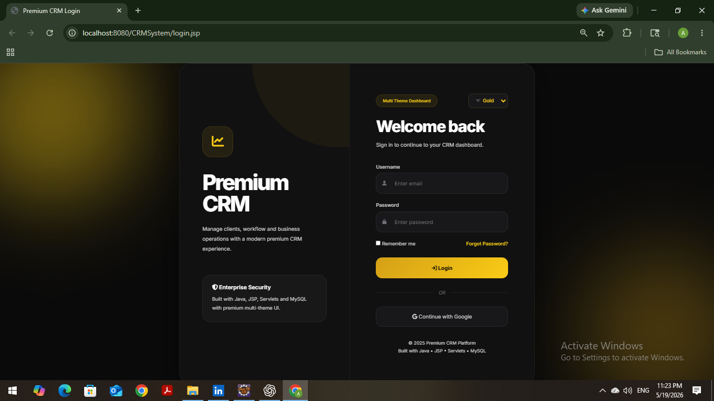

### Dashboard
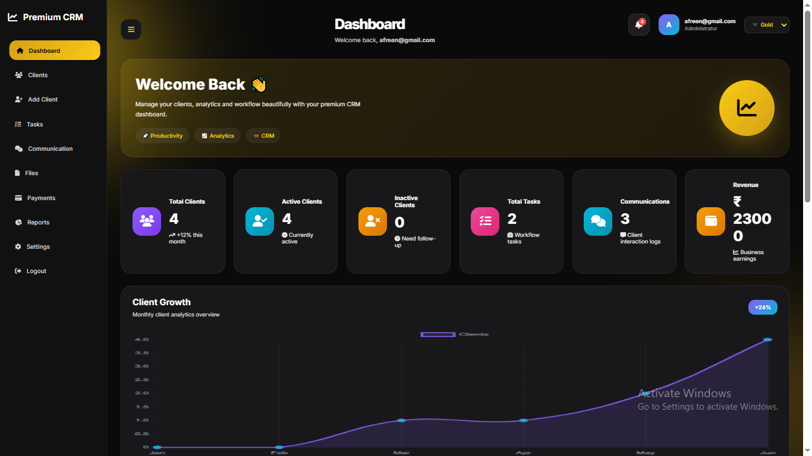

### Dark Theme
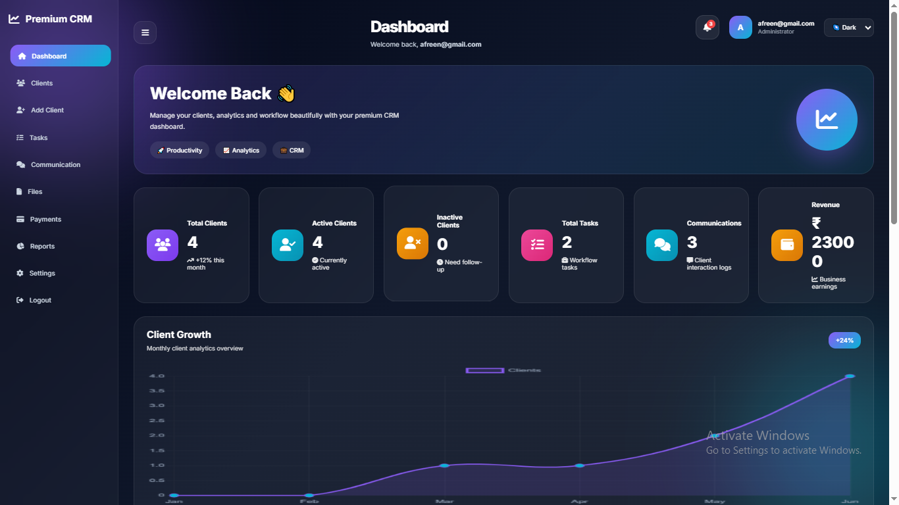

### Light Theme
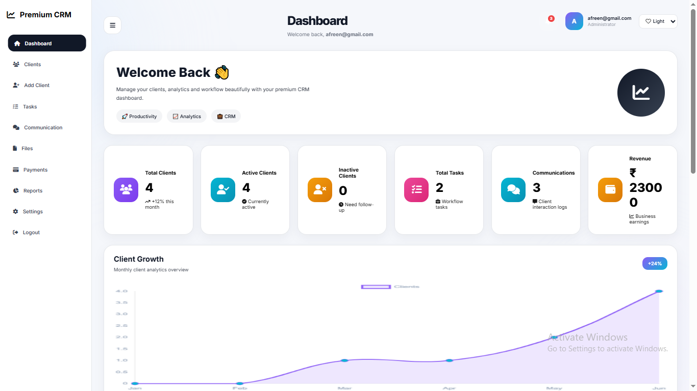

### Clients
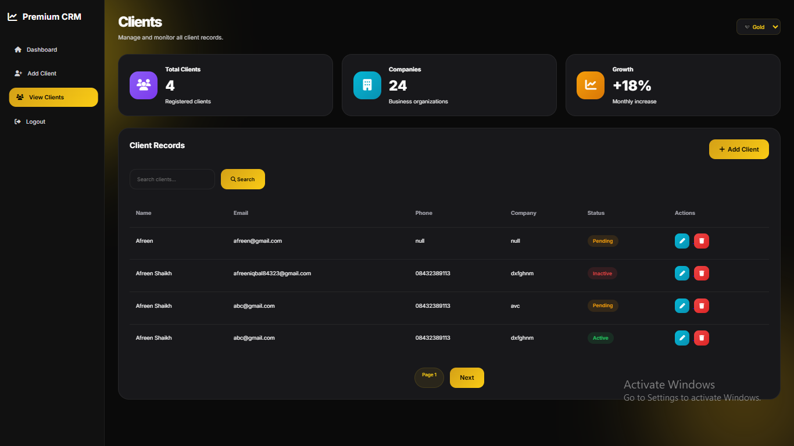

### Add Client
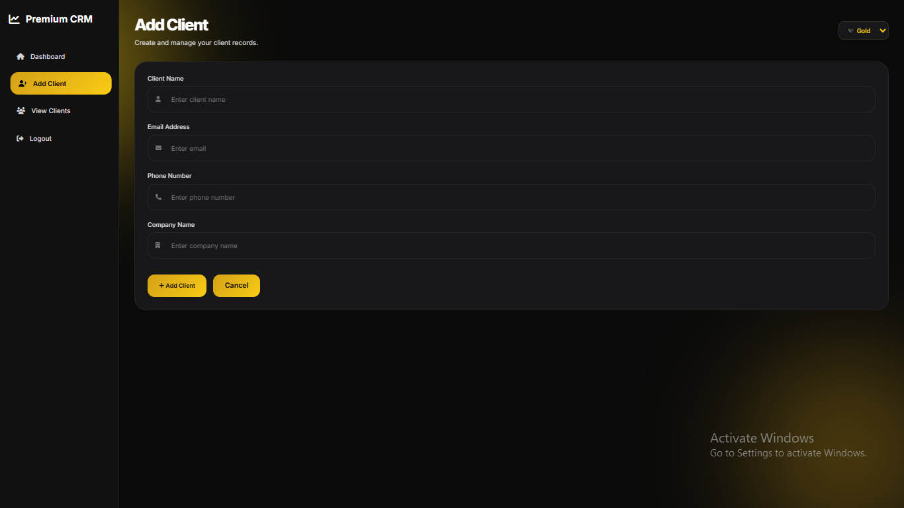

### Tasks
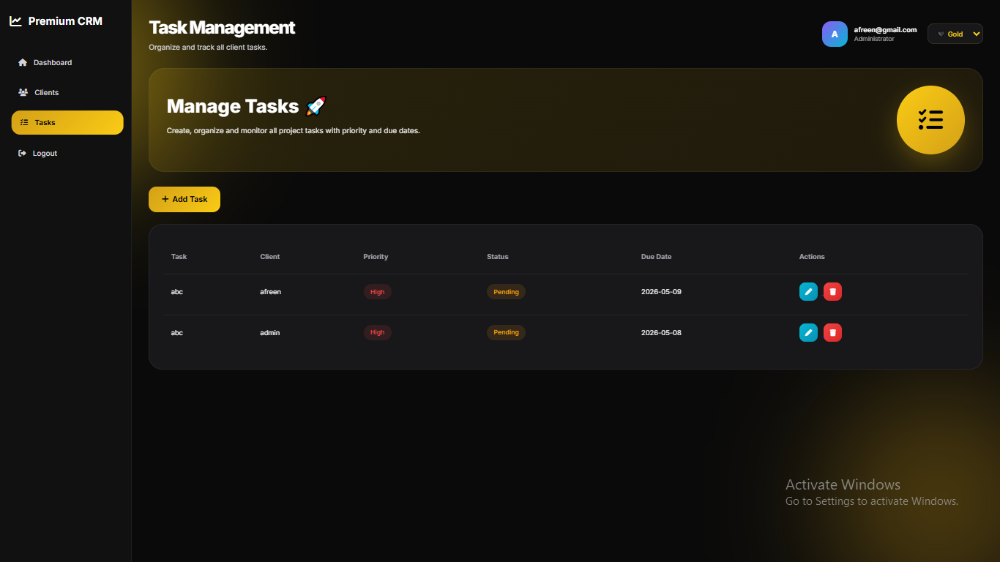

### Communication Center
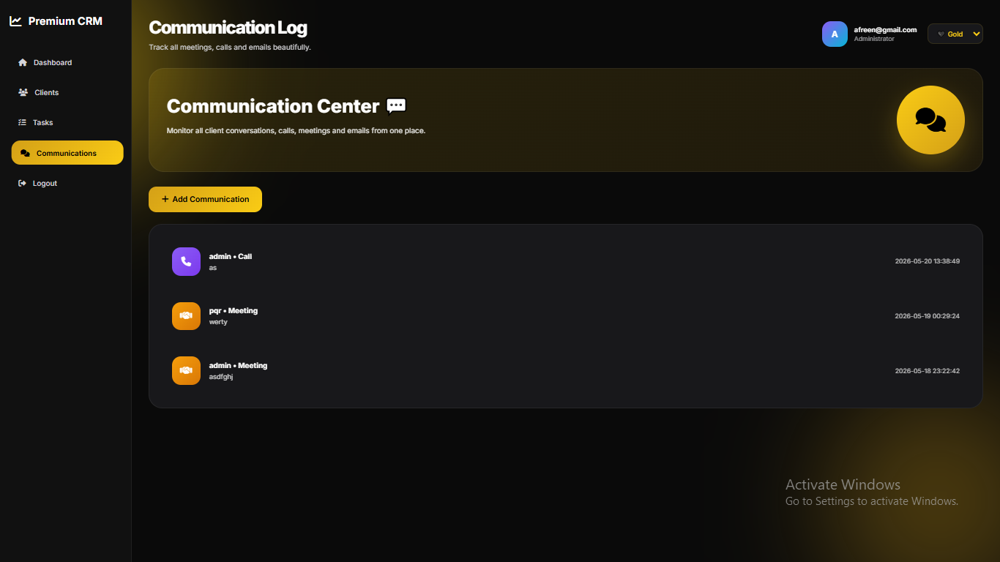

### Files
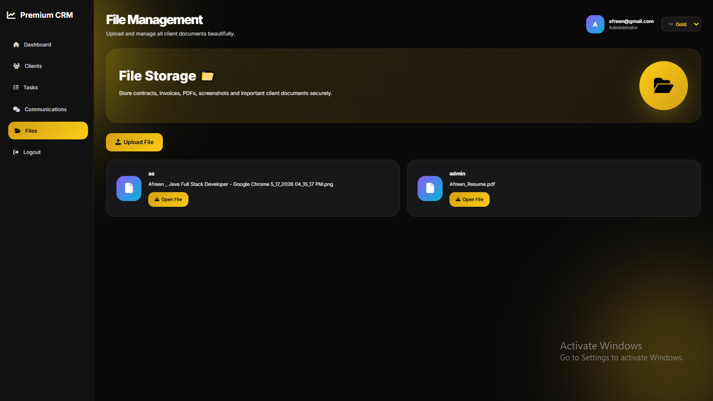

### Invoices
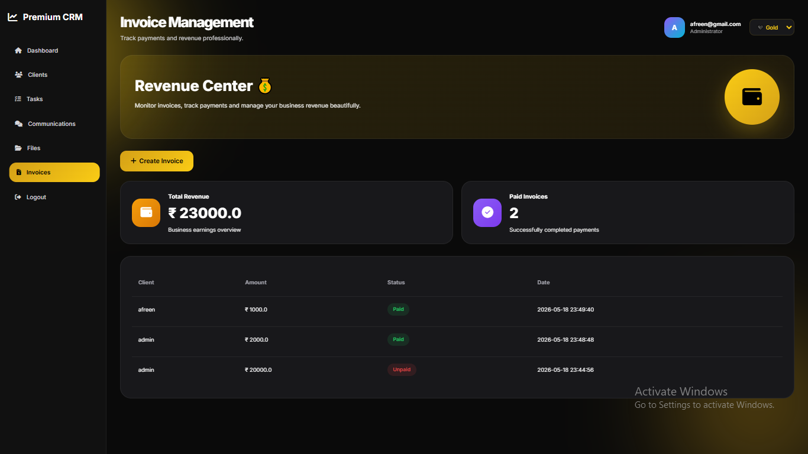

### Reports
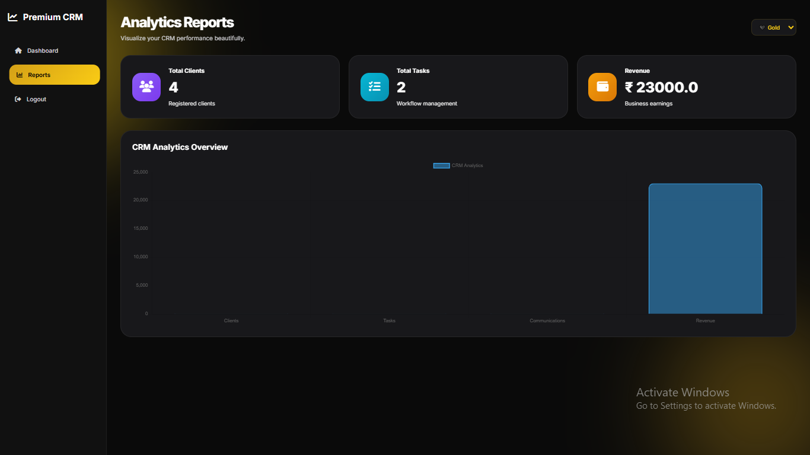

---

## 👩‍💻 Developed By

**Afreen Iqbal**

Full Stack Web Development Internship — Future Interns
